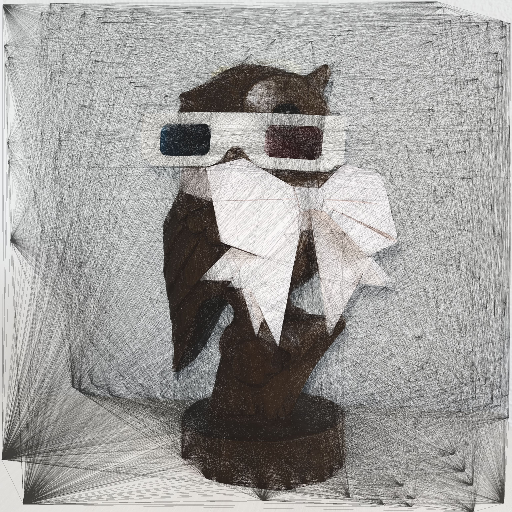

# ps2a (Picture To String Art)

A Rust library and a CLI tool to transform your pictures into String Art 🧵
This is a Rust rewriting of a [project i did for school](https://github.com/Hvrnbi/VISI201) (documentation in french 🥖).



# CLI tool installation

The easiest way to install p2as is to use [cargo](https://doc.rust-lang.org/cargo/index.html) with this command :
```shell
cargo install p2sa
```

You can now use it in your terminal with this command :
```shell
p2sa your-src-image-path output-path output-width output-height nails-count
```

# Demo


# Library usage

⚠️ This crate is not published yet, this guide is not working at the moment ⚠️

To use the library, you need to add it to your project using [cargo](https://doc.rust-lang.org/cargo/index.html) with this command :

```shell
cargo add p2sa
```

You can now call the p2sa function :
```rust
use p2sa::p2sa;

fn main() {
    // p2sa(src_path: String, output_path: String, output_size: [u32; 2], nails_count: u32);
    p2sa("path/to/your/picture.png".to_string(), "path/to/your/result.png".to_string(), [1024, 1024], 400);
}
```

# Features

- BMP, GIF, ICO, JPEG, PNG, WebP, and more format supported (SVG coming soon !)
- Custom output resolution supported
- Custom number of nails supported

# How it works

The nails are randomly placed on the edges of the shapes.
The program starts on the first nail of the list, and simulates the reduction of the difference between the original image and the working image.
It chooses the line that reduces the difference the most, and repeat this steps until the error increase 3 times in a row.

For more details, you can check [the wiki page of my school project](http://os-vps418.infomaniak.ch:1250/mediawiki/index.php/Filage_d'image_et_trac%C3%A9_de_droites_pour_un_rendu_artistique).
It's in french but may be translated.

# Usage advices

If the output lacks details, you may want to increase the nails count.
It may take some time (a few minutes) if you try to obtain an image of more than 2000x2000 px and more than 600 nails.
You can obtain nice results with smaller resolutions.

# Thanks

This crate relies heavily on the rust crates [image](https://crates.io/crates/image) and [edge-detection](https://crates.io/crates/edge-detection).

# Support me

[](https://ko-fi.com/G5J5206K5C)
[](https://liberapay.com/Harupi/donate)

